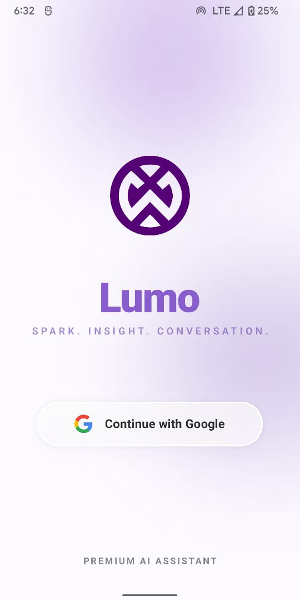
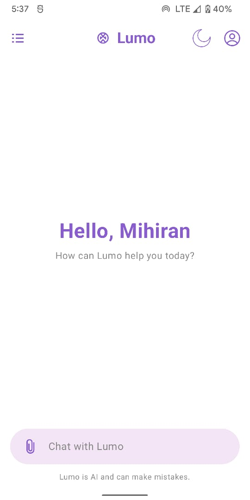
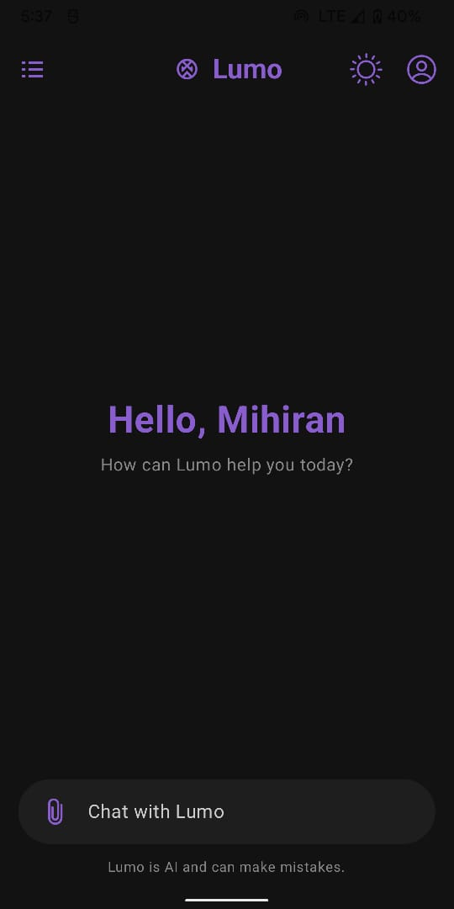
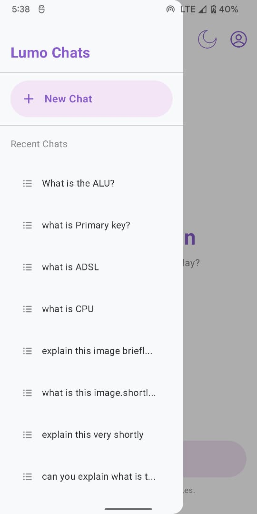
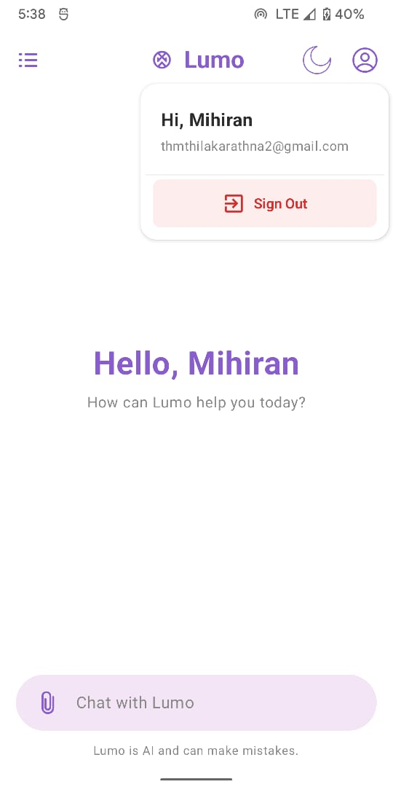
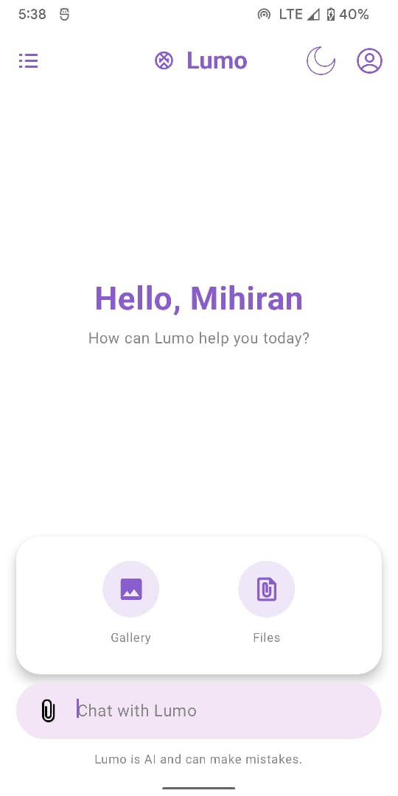
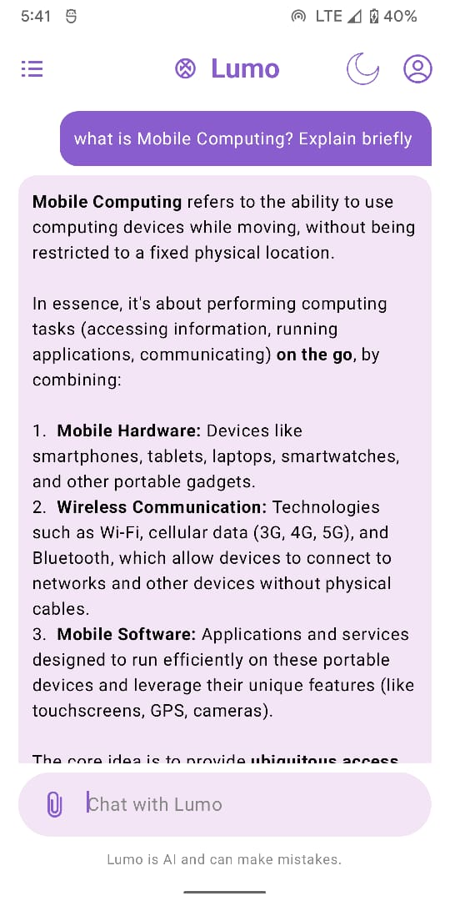
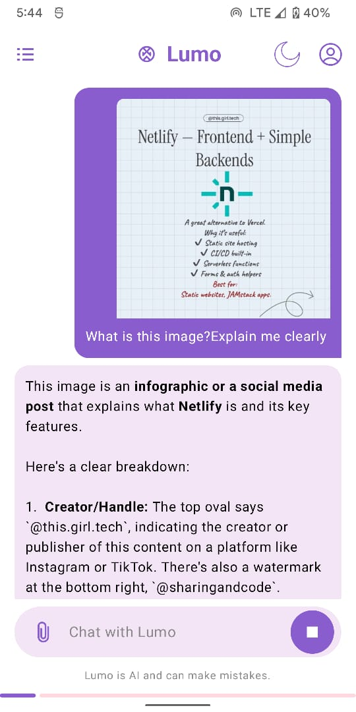
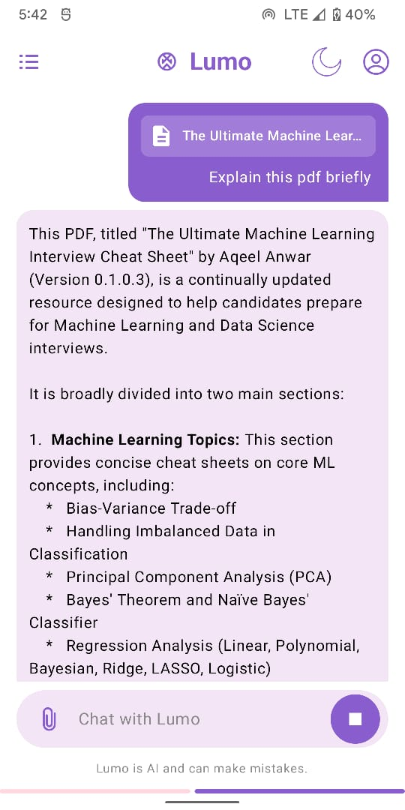

<div align="center">

# Lumo AI Assistant 🌟

A modern, multimodal Android AI assistant built with Jetpack Compose and Google Gemini API.  
Supports text, image, and PDF analysis with a beautiful, adaptive UI.

[](https://android.com)
[](https://kotlinlang.org)
[](https://developer.android.com)
[](LICENSE)

</div>

---

## ✨ Features

- 🤖 **Multimodal AI:** Chat naturally, analyze images, or summarize PDF documents via the Gemini API
- 🔐 **Google Authentication:** Secure one-tap login powered by Firebase
- 🎨 **Dynamic Theming:** Dark & Light mode with dynamic color adaptation
- 💫 **Fluid UI:** Custom ripple effects, edge-to-edge layout, and an interactive "Lumo Ambient Glow" login background
- 🗂️ **Smart Chat History:** Auto-saves conversations to Firestore with a 30-day retention policy

---

## 📱 UI Showcase

| Login Screen | Home (Light Mode) | Home (Dark Mode) |
|:---:|:---:|:---:|
|  |  |  |

| Sidebar Menu | Profile & Sign Out | File Attachment |
|:---:|:---:|:---:|
|  |  |  |

| Text Chat | Image Analysis | PDF Analysis |
|:---:|:---:|:---:|
|  |  |  |

---

## 🏗️ Project Structure
```
com.mihiran.lumo/
├── data/                  # Data models and entities
│   └── ChatMessage.kt
├── repository/            # API & data source communication
│   └── GeminiService.kt
├── ui/                    # All Jetpack Compose UI code
│   ├── components/        # Reusable UI elements (bubbles, inputs)
│   ├── screens/           # App screens (Login, Home, Splash)
│   └── theme/             # Colors, typography, and theme setup
└── viewmodel/             # UI state & business logic
    └── ChatViewModel.kt
```

---

## 🛠️ Tech Stack

| Layer | Technology |
|---|---|
| UI Framework | Jetpack Compose (Kotlin) |
| Authentication | Firebase Authentication |
| Database | Cloud Firestore |
| AI Engine | Google Gemini API |
| Image Loading | Coil |
| PDF Processing | PDFBox-Android |

---

## 📋 Prerequisites

| Requirement | Version |
|---|---|
| Android Studio | Hedgehog (2023.1.1) or newer |
| Kotlin | 1.9.0+ |
| Gradle | 8.0+ |
| Min SDK | 24 (Android 7.0) |
| Target / Compile SDK | 34 (Android 14) |

---

## 🚀 Getting Started

### 1. Clone the repository
```bash
git clone https://github.com/Mihiran-Thilakarathna/Lumo-AI-assistant.git
```

### 2. Open in Android Studio
Open the cloned project in Android Studio (Hedgehog or newer).

### 3. Configure API Keys
Open `local.properties` in the root directory and add your Gemini API key:
```properties
GEMINI_API_KEY=your_actual_api_key_here
```

### 4. Firebase Setup
1. Create a new project in the [Firebase Console](https://console.firebase.google.com/)
2. Add an Android app to your Firebase project
3. Download the `google-services.json` file
4. Place it inside the `app/` directory of the project

### 5. Build & Run
Run the project on an Android emulator or a physical device.

---

## 🤝 Contributing

Contributions, issues, and feature requests are welcome!  
Feel free to check the [issues page](https://github.com/Mihiran-Thilakarathna/Lumo-AI-assistant/issues).

1. Fork the repository
2. Create your feature branch (`git checkout -b feature/AmazingFeature`)
3. Commit your changes (`git commit -m 'Add some AmazingFeature'`)
4. Push to the branch (`git push origin feature/AmazingFeature`)
5. Open a Pull Request

---

## 👤 Author

**Mihiran Thilakarathna**

[](https://github.com/Mihiran-Thilakarathna)
[](https://www.linkedin.com/in/mihiran-thilakarathna-9478302a8)

---

## 📄 License

This project is licensed under the **MIT License** — see the [LICENSE](LICENSE) file for details.

---

<div align="center">
  <sub>Built with ❤️ using Jetpack Compose & Google Gemini</sub>
</div>